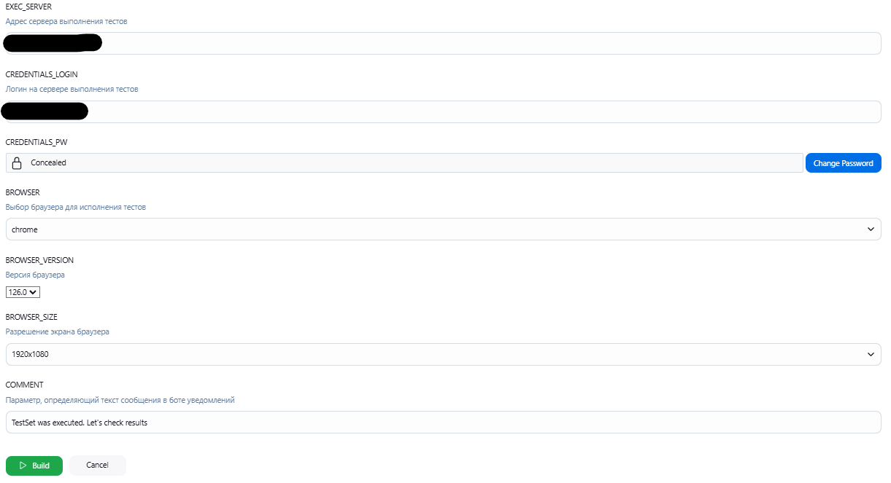
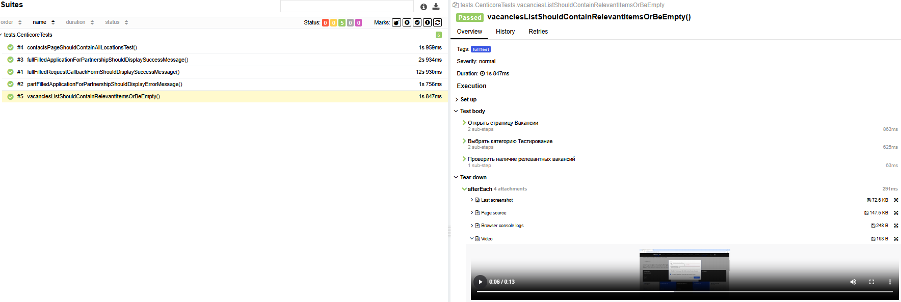
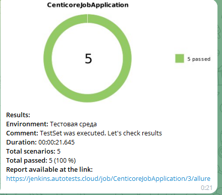

# Тестовое задание для сайта компании [Centicore](https://centicore.ru/)

# Содержание
- [Стек технологий](#стек-технологий)
- [Список тестов](#список-тестов)
- [Запуск автотестов](#запуск-автотестов)
- [Allure-отчет](#allure-отчеты)
- [Уведомления в телеграм](#уведомления-в-телеграм)

## Стек технологий

  

Автотесты в проекте написаны на <code>Java</code> с использованием фреймворка [Selenide](https://selenide.org/),  
сборщик - <code>Gradle</code>,  
фреймворк модульного тестирования - <code>JUnit 5</code>,  
удаленный запуск браузера и прохождение сценариев - [Selenoid](https://aerokube.com/selenoid/),  
управление удаленным запуском, настройка параметров и формирование отчета - <code>Jenkins + Allure</code>.  
Реализована отправка результатов в <code>Telegram</code> при помощи бота.

### Список тестов
**fullFilledApplicationForPartnershipShouldDisplaySuccessMessageTest** - Тест отправки заявки для сотрудничества
**partFilledApplicationForPartnershipShouldDisplayErrorMessageTest** - Тест ошибки при неполном заполнении формы
**vacanciesListShouldContainRelevantItemsOrBeEmptyTest** - Тест фильтра вакансий по специальности
**fullFilledRequestCallbackFormShouldDisplaySuccessMessageTest** - Тест формы заказа обратного звонка
**contactsPageShouldContainAllLocationsTest** - Тест отображения локаций офисов

### Запуск автотестов
Автотесты запускаются сборкой в <code>Jenkins</code> с заполнением параметров выполнения  

  

- **EXEC_SERVER** - Адрес сервера выполнения тестов
- **CREDENTIALS_LOGIN** - Логин для доступа к серверу выполнения тестов
- **CREDENTIALS_PW** - пароль для доступа к серверу выполнения тестов
- **BROWSER, BROWSER_VERSION, BROWSER_SIZE** - Выбор браузера/версии/разрешения экрана для исполнения тестов
- **COMMENT** - Параметр, определяющий текст сообщения в боте уведомлений

### Allure-отчеты

Allure-отчет содержит в себе результаты выполнения всех тестов с дополнительной информацией:
- Скриншот финала теста
- код страницы
- журнал консоли браузера при выполнении теста
- видео-запись выполнения теста

  

### Уведомления в телеграм

По завершении выполнения тестов отправляется краткий отчет в телеграм-бот со ссылкой на полный allure-отчет

 